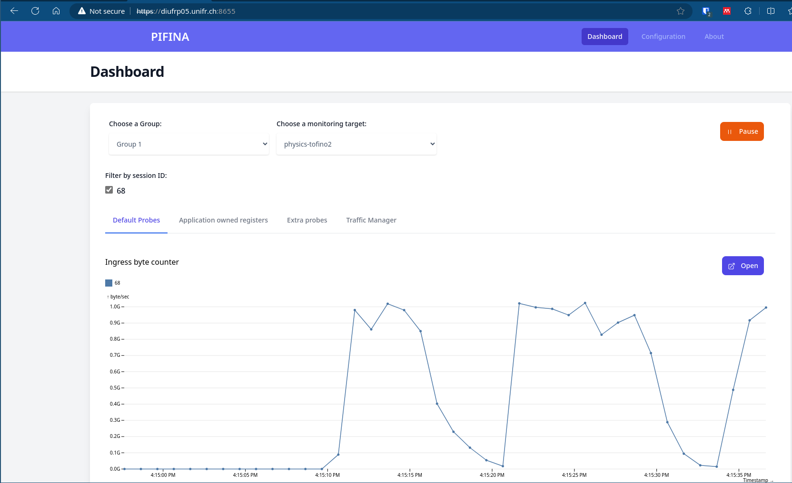

# PIFINA

Performance Introspector for in-network applications (PIFINA)

---

PIFINA is a performance framework to introspect in-network applications written in P416 programming language running on Intel Tofino powered switches. The framework has been developed and tested for the Intel Tofino architecture version 2, but it should be backwards compatible to Tofino 1.

Using PIFINA cli tool a given P416 application can be enriched with performance counters like byte & packet counter in various place of the pipeline.
 Only interesting packets can be introspected using traffic selector rules, which can be matched on any parsed header field. In addition, the values of selected user defined registers can be probed and visualized. 
In that way, low/high watermark metrics specific to the running application can be implemented by the user itself, which will be probed by PIFINA.  Furthermore, metrics from the traffic manager are visualized as well.

One of the benefits of PIFINA is that it allows users to adjust the traffic selector rules and to add user-defined registers for probing at runtime without the need to recompile the whole P416 application.

Check the [User Guide] for more information.

[Getting Started]: getting-started.md
[System architecture]: user-guide/architecture.md
[User Guide]: user-guide/README.md

