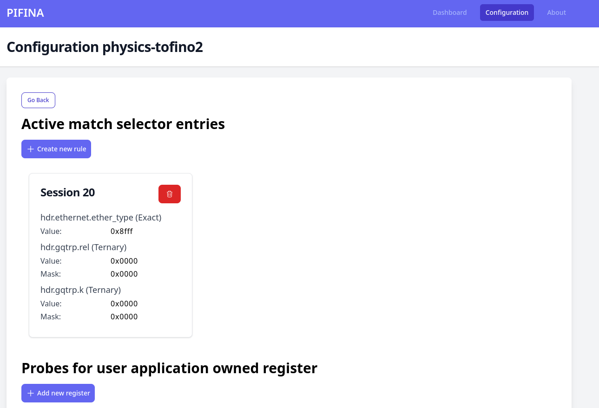
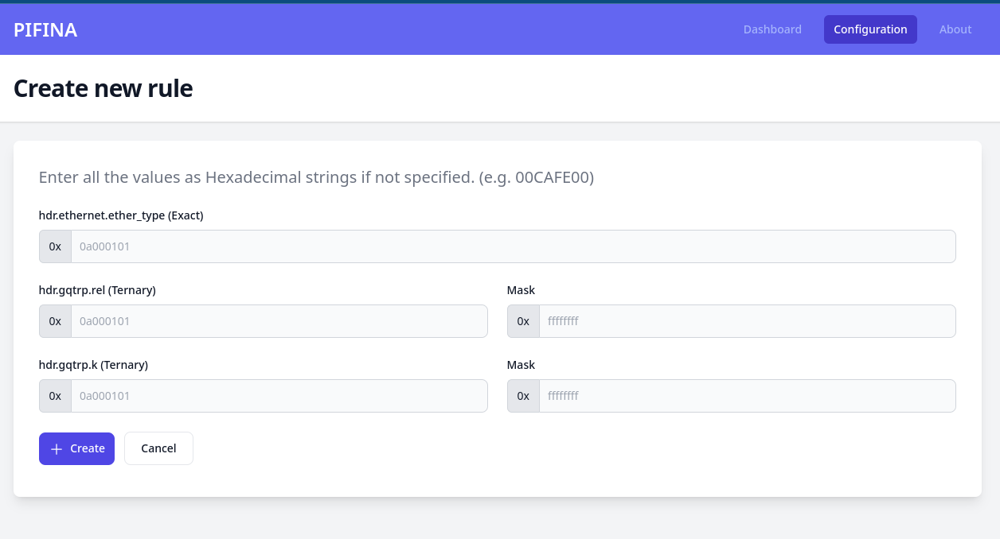
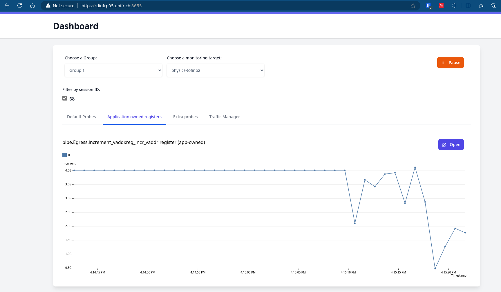

# User guide
## Create traffic selector rules
Pifina only captures traffic flows, which have been defined by the user. This will be done using a match-action table, where the user can define any parsed header fields to match on during the PIFINA library generation.
As soon as the `tofino-probe` and the collector are running, follow the steps below:

1. open the PIFINA web application and go to the `Configuration` navigation item in the menu.
2. Select your Tofino switch
3. Click on `Create new rule` button in `Active match selector entries` section

4. Add your traffic selector rules as hex values 

5. Click on `Add` button

## Monitor user defined register
PIFINA is able to monitor and visualise any registers in use. You can use this feature to implement a low/high watermark metric by yourself.

1. open the PIFINA web application and go to the `Configuration` navigation item in the menu.
2. Select your Tofino switch
3. Click on `Add new register` button in `Probes for user application owned registers` section

4. Click on `show all available registers` to view all available registers
5. Click on the name of the register you would like to monitor

6. Define the register index position, which you would like to monitor.
5. Click on `Add` button



## Generate P4 skeleton application by PIFINA cli
Use the flag `--gen-skeleton` to generate a skeleton for a P4 application enriched with PIFINA.
The key flags defines the name of the header fields to match on for interesting packets.
```bash
./pifina generate --gen-skeleton --key hdr.ethernet.ether_type:exact \
    --key hdr.gqtrp.rel:ternary --key hdr.gqtrp.k:ternary \
    --output ~/src/myapp/include
```

# Add additional metrics to PIFINA dashboard
1. Define a new constant with the name of the new metric to match on in the web application in the `pifina-sdk/frontend/src/lib/models/metricNames.ts` file
```typescript
export const PROBE_ETHTOOL_RX_OOB = "rx_out_of_buffer"
```
2. Add a new property for the new metric in the `PIFINA_CHART_CONFIG` constant located in the `pifina-sdk/frontend/src/lib/config/chartConfig.ts` file.
```typescript
export const PIFINA_PROBE_CHART_CFG: PIFINA_CHART_CONFIG = {
    // ...
    [pb.PROBE_ETHTOOL_RX_OOB]: {
        yAxisName: pb.Y_AXIS_NAME_EVENTS_COUNT,
        title: "Out of buffer events for RX"
    },
```
  * Set the title of the chart with the `title` property
  * Set the y-axis title with `yAxisName` property.
  * You can optionally change the tick format of the x axis using the propery `tickFormat`. You can find the available options for the tick format on the [D3 site](https://github.com/d3/d3-format#api-reference)
3. Afterwards, you need to define the position of the chart in the dashboard in the `pifina-sdk/frontend/src/lib/config/dashboardConfig.ts` file.
  * If you use an two-sized array, then the chart will share the row with another chart. If you directly define the chart name without an inner array, then the chart will use the full row.
```typescript
port const PIFINA_ETHTOOL_CHART_ORDER = [
    // ...
    // 2 charts in 1 row
    [PROBE_ETHTOOL_RX_PAUSE, PROBE_ETHTOOL_TX_PAUSE],
    // 1 chart in 1 row
    PROBE_ETHTOOL_RX_OOB
]
```