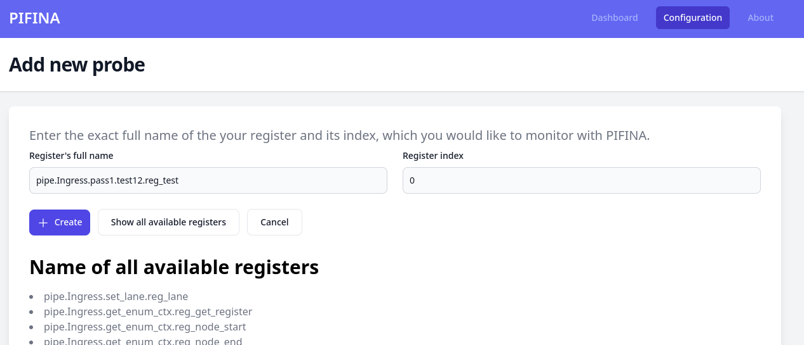

# User guide
## Create traffic selector rules
Pifina only captures traffic flows, which have been defined by the user. This will be done using a match-action table, where the user can define any parsed header fields to match on during the PIFINA library generation.
As soon as the `tofino-probe` and the collector are running, follow the steps below:

1. open the PIFINA web application and go to the `Configuration` navigation item in the menu.
2. Select your Tofino switch
3. Click on `Create new rule` button in `Active match selector entries` section

4. Add your traffic selector rules as hex values 

5. Click on `Add` button

## Monitor user defined register
PIFINA is able to monitor and visualise any registers in use. You can use this feature to implement a low/high watermark metric by yourself.

1. open the PIFINA web application and go to the `Configuration` navigation item in the menu.
2. Select your Tofino switch
3. Click on `Add new register` button in `Probes for user application owned registers` section

4. Click on `show all available registers` to view all available registers
5. Click on the name of the register you would like to monitor

6. Define the register index position, which you would like to monitor.
5. Click on `Add` button


## Generate P4 skeleton application by PIFINA cli
Use the flag `--gen-skeleton` to generate a skeleton for a P4 application enriched with PIFINA.
The key flags defines the name of the header fields to match on for interesting packets.
```bash
./pifina generate --gen-skeleton --key hdr.ethernet.ether_type:exact \
    --key hdr.gqtrp.rel:ternary --key hdr.gqtrp.k:ternary \
    --output ~/src/myapp/include
```