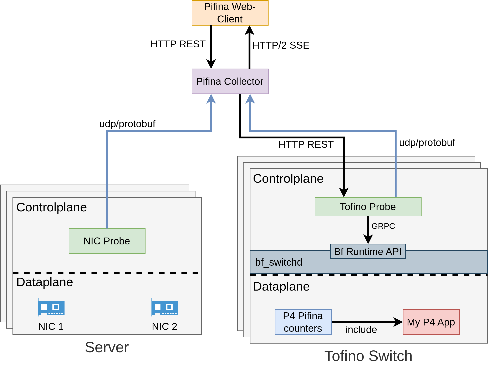

# Systemarchitecture

PIFINA consists of 5 components:

* Pifina P4 counters
* Tofino Probe
* NIC probe
* Pifina collector
* Pifina Web application

## Pifina P4 counters
The Pifina P4 counters live in the data plane and will be imported by the main P4 application. There is always a counter at the beginning, the end of the ingress pipeline. Moreover, there are counters at the beginning and the end of the egress pipeline. Additional counters can be generated by the pifina cli and these additional ones can be inserted at any point within the pipeline.

## Tofino Probe
The Tofino probe runs in the control plane of the Tofino switch and it collects the counters over gRPC interface of Bf runtime, transforms them, samples them, and stores them in memory.

## NIC Probe
Runs on the sender or receiver side like on a Linux server. It collects performance counters from the NVIDIA Connect-X network interface cards and forwards them to the Pifina collector

## Pifina collector
Exposes a Protobuf API for receiving metrics from Tofino probes and NIC probes. In addition, it serves the web application to manage and to visualise the metrics.

## Pifina web application
It is a single page application, visualises the metrics. It opens a HTTP/2 Server sent event channel to the Pifina collector. In that way, metrics arrive on the dashboard at almost real time.